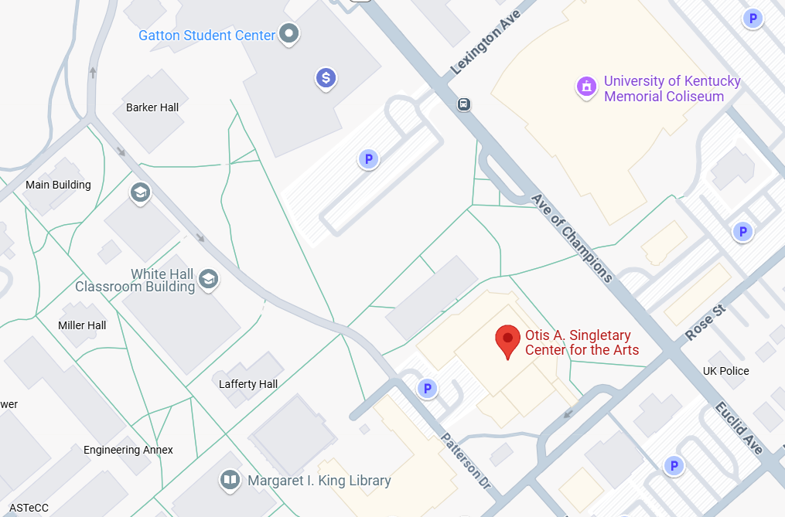

## Opening Question

&nbsp; 
&nbsp; 
&nbsp; 
&nbsp; 

**What is language for?**

## Linguistics Linkages (Ling-Link)

* Daily activities related to the day’s content\, designed to get your brain moving = Engagement\!\!
* Every lecture will start this way
* For today’s Ling\-Link:
  * Talk to the person sitting right next to you \(groups of 3 are fine\)\. Tell each other your name\, major\, and why you’re taking this class\. \(2 minutes\)
  * Next\, tell your group something interesting about yourself  _related to language_ \. It can be anything – what you call a carbonated beverage\, a word you/your friends pronounced funny as a child\, your experience with languages other than English\, etc\. \(2 minutes\)

## Your Instructional Team!

- Professor:
  * Kevin B. McGowan \([kbmcgowan@uky\.edu](mailto:kbmcgowan@uky.edu)\)
 
- TAs:

  * Grace Anderson: Sections: 003, 005
  * Jocelyn Brown: Section: 006\
  * Sarah Ertel: Sections: 001, 004\
  * Nora O'Brien: Section: 002 \
  * Stella Takvoryan: Section: 007 \

## Where & when?

:::::: {.columns}
:::: {.column width="40%"}
{fig-alt="A map of UK's campus centered on the classroom building"}
::::

:::: {.column width="60%"}
::: {.list-table}
- - Section
  - Details

- - Lecture
  - MW 10 - 10:50 am
  
    Whitehall 110
    
- - Section 001
  - F 10am → Whitehall 230

- - Section 002
  - F 10 am → Whitehall 226

- - Section 003
  - F 10 am → Whitehall 233

- - Section 004
  - F 11 am → Whitehall 230

- - Section 005
  - F 11 am → Whitehall 226

- - Section 006
  - F 12 pm → Funkhouser 306A

- - Section 007
  - F 12 pm → Funkhouser 311
:::
::::
::::::

## LIN 211

* A broad introduction to the field of linguistics
  * What is that?
* Syllabus is on Canvas
  * Let’s walk through it\!
  * [https://uk\.instructure\.com/](https://uk.instructure.com/)

<!--
## QUESTION SLIDES

* Insert one of each kind of question:
  * Who is your LIN 211 professor?
  * What is language for?
  * Where are you from?
-->