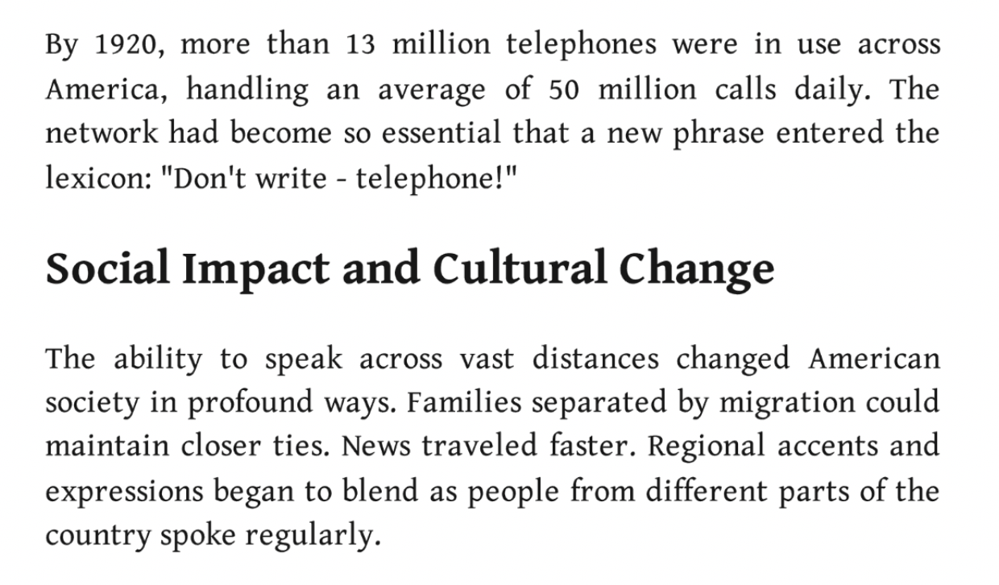
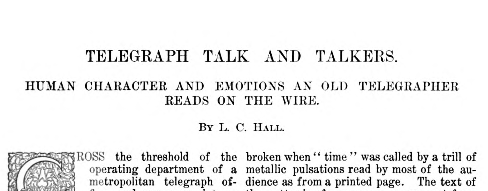
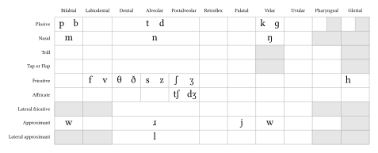
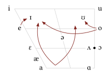
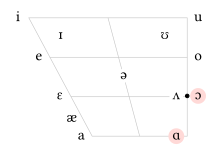
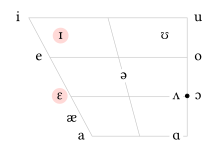

## Ling Link

:::: {.columns}

::: {.column width="50%"}

- Let's take this dialect quiz together: [https://mydialect.us/quiz-quick.html](https://mydialect.us/quiz-quick.html)
- watch what happens to the map as you choose different answers
- what kind of language features is the quiz using?
- discuss your results with the people near to you
:::

::: {.column width="50%"}

```{r}
#| label: qr_code
#| message: false
#| warning: false
#| include: false
code <- qrcode::qr_code( "https://mydialect.us/quiz-quick.html")

qrcode::generate_svg(qrcode = code, filename = "images/qr_code.svg", show = FALSE )
```
{width="100%"}
:::

::::

## Terminology

:::: {.incremental}

- **dialect**: A regional or social variety of a language with its own characteristic lexical, phonological, syntactic, and pragmatic properties
- **accent**: Constellations of sounds that, together, point to a regional or social identity (essentially the phonological and phonetic aspect of a dialect)
- **speech community**: A group of people with shared linguistic expectations and norms or shared community membership. See also: communities of practice [@eckert2000language; @eckert2007]


::::

:::: {.aside}

For more on today's topic, see: [@BarrettCramerMcGowan2023]

::::

# Why are there still different dialects?

## Predictions of the demise of dialects

::::: {.incremental}

- Every new communication technology inspires journalists to predict that regional accents and dialects are going away
- Right now the prediction is that TikTok and social media will eroding regional variation
- Cell phones were the culprits before that
- Television & cable television were going to eliminate regional variation
- Airline travel was going to make it so people in Texas would sound just like people in Toronto
- Radio was definitely going to eliminate regional varieties of languages
- Land line telephones
- Train travel
- The telegraph

:::::

## Some even just claim it already happened!


:::{.notes}

In 1920, according to the US Census, there were 106,021,537 people in the United States

~12.2% of them had phones and this was supposed to fundamentally reshape how language worked

:::

## Reality is not like that [@hall1902telegraph]



## The Telegraph and Linguistic Variation

- "A telegrapher’s Morse … is as distinctive as his face, his tones, or his handwriting and as difficult to counterfeit as his voice or writing."
- "A woman's Morse is as feminine as her voice or her handwriting."
- "And it would be quite possible for an imaginative operator to build up a fairly accurate mental image of [an unknown sender], whether he ate with his knife, or wore his hat cocked on the side of his head, or talked loud in public places."

## Hall (1902) "A REBEL BETRAYED BY HIS SOUTHERN ACCENT."

> A Confederate [soldier], for example, encounters on the march a line of wire which he suspects is being used by the enemy. He taps the wire, cuts in his instruments, and listens. His surmise is correct; he "grounds off" one or the other end, and, trying to disguise his style of "sending," makes inquiries calculated to develop important information. But the Southern accent is recognized in his Morse by the distant manipulator, who, indeed, may have been a co-worker in the days before the war.

> So the intruder gets only a good-humored chafing. "The trick won't work, Jim, says the Federal operator. Let's shake for old times' sake, and then you 'git' out of this."

## The Telegraph and Regional Variation

- Regional variation, instead of being destroyed by new technologies, comes with us into these new worlds we build for ourselves
- Regional and Social Variation (dialect) helps us both maintain the social groupings that were already important to us offline
- And build new ways of belonging to, or distancing ourselves from, these new speech communities technologies afford us

## A fundamental misunderstanding

::::: {.incremental}

- A common thread in these predictions is the idea that every dialect is somehow an unfortunate mistake
- and that, if only people could hear each other, dialect would go away
- But think about it seriously for a moment: do you want to sound like you're from Boston?  from New York City?  From Detroit?  From Los Angeles?
- Unless you're *from* one of these places, you probably don't want that at all!
- If you like where you're from, you want to sound like that place.  And so does everyone else. [@reed2018]
- So if a dialect *isn't* a mistake, what is it?

:::::

## Language is not (just) for communication

::::: {.incremental}

- When we open our mouths to speak we reveal not only what we're trying to say but who we are, where we come from, how we're feeling, and so much more
- Think about euphemism, slang, and even swearing
- Think about the fact that being an English speaker makes you a part of a speech community that spans the entire globe.
- We use language to form, join, maintain, defend, and separate ourselves from social groups

:::::


## What if it *feels* like accents and dialects are going away?

- it has always felt, to everyone, like accents and dialects are going away
- this is because language is constantly changing.
- and--when you're living in the middle of it--change feels like loss
- dialects & accents really are changing around you, all the time, but what they're *not* doing is disappearing!
- Because dialects aren't accidents, they're not unfortunate wrinkles in the otherwise smooth fabric of language, dialects serve a core social function

## Bits and Pieces Sound:

::: {.r-fit-text}
Phonetics!
:::

## Phonetic Features

- Consonants:
  - Place of Articulation
  - Manner of Articulation
  - Voicing
- Vowels:
  - Jaw & Tongue Height
  - Tongue Frontness
  - Tenseness
  -  Lip Rounding

## English Consonants

{width="100%"}

## English Vowels

{width="100%"}

# How do you pronounce “cot” and “caught”?


## Cot/Caught Merger

{width="100%"}

## /kɑt/ /kɔt/ merge to /kɑt/

* Also called the  __low back merger__ \,
  * It’s about where /ɑ/ and /ɔ/ sound the same in certain dialects
  * In many dialects of English, sounds differ in  __height__  \(/ɑ/ is low\, /ɔ/ is mid\) and  __roundedness__  \(/ɔ/ is round\, /ɑ/ is not\)
  * So, in Michigan, for example, /kɑt/ = ‘cot’ and /kɔt/ = ‘caught’
  * While across the border in Canada: /kɑt/ = ‘cot’ and /kɑt/ = ‘caught’


# Distribution


{width="100%"}


# How do you pronounce “pen” and “pin”?


## Another regional feature


## Pin/Pen




## Dialect isn't going anywhere

* We know that every language is composed of more than one dialect
  * Thus\, everyone has a dialect \(and an accent\)
  * Dialect ≠ bad
* And all dialects\, just like all languages\, are systematic\, rule\-governed\, and patterned
  * No language is without  __grammar__ \, the \(descriptive\) rules that define a language
  * Grammar includes rules about sounds\, words\, sentences\, conversations\, etc\.
* But we where did these dialects come from? How did they develop? Why?


## But why?!?!

* Geographical distance?
  * Speakers on islands or in mountains \(historically\) have less contact with speakers of other varieties due to being geographically isolated\, causing those varieties to differ
  * Ex\. Ocracoke Island as compared to other dialects of American English
  * An even better example of divergence would be French\, Spanish\, Italian\, Portuguese\, etc\. with respect to Latin
* Social distance?
  * When people do not spend a great deal of time together in interaction\, their dialects are not likely to be very similar and are not likely to influence each other
  * Ex\. The dialects of different classes in the US
  * Or how African American speech has historically differed from white varieties of American English


## Language variation ≠ random!

* Dialects can vary in all parts of the system
  * That is\, there is more to dialects than funny words and different accents\!
  * There are rules related to the sounds \(phonetics\)\, word formation \(morphology\)\, sentence structure \(syntax\) – and more\!
* Language change isn’t random
  * We need to know what can and can’t happen in language
  * Social pressures might cause the change to be accepted/rejected\, but the change must follow principles of how language works


## Syntactic Example

| Present | Past |
| :-: | :-: |
| I  _is_ 		You  _is_ 	He/she/it  _is_ We  _is_ You \(pl\.\)  _is_ They  _is_ | I  _was_ 			You  _was_ 	He/she/it  _was_ We  _was_ You \(pl\.\)  _was_ They  _was_ |


## Changes from outside


* Language contact = new settlement can bring different groups into contact
  * Early American English was heavily influenced by Native American languages in the Algonquin\, Iroquoian\, and Siouan families
  * They had words for things the British had never seen\, like  _raccoon _ and  _chipmunk_
  * Lexical borrowing = cultural borrowing\!
* English has borrowed A LOT\!
  * Morphemes: German  _–fest_ \, French  _–_  _ee_
  * Syntax:
    * German construction “Are you going with?”
    * African\-influenced absence of  _be_  in “They \_\_\_ in the house”


## What’s next?


* Come to lecture Monday for our second SPOTLIGHT lecture!
  * What methods and ethics of inquiry are used?
  * Remember the last SPOTLIGHT?
* Come to lecture Wednesday for the start of a new module
  * Language in the World
  * “How do kids learn to talk?”
* Quiz 6 Friday\!
* Observation notes \#3 due FRIDAY\!\!

## References
