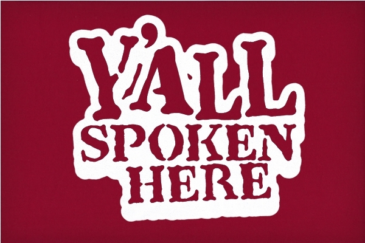

# Ling Link! 

::: {.nonincremental}

- Part of what I said we would do in a class like this is dive deep on bits of language that are an ordinary and mundane part of your everyday life
- So – let’s try it\!
- Let’s say you walk out of the classroom today and find a note on the floor that says:
- __“He will be there tomorrow\.”__
  - What information do you know? What evidence supports that knowledge?
  - What information is left unanswered? What evidence supports that knowledge?
- Spend 2 minutes talking to your seat neighbor(s)\!

:::

::: {.nonincremental}

## Grading Breakdown (from the syllabus)

| Activity | Percentage |
|:---------|:----------:|
| Quizzes (10): | 30% |
| Observation notes (5): | 15% |
| Data Collection: | 20% |
| Data Analysis: | 25% |
| Participation: | 10% |
: Grade Breakdown {.striped .hover}

::: 

## Course Activities and Exams (from the syllabus)

- **Quizzes (30%)**: Each week in discussion sections (beginning during the second week of classes), students will complete a short quiz in Canvas over the material that has been covered in lecture and in the course readings. Twelve 12 total quizzes and the lowest two (2) quiz grades will be dropped.

- **Observation notes (15%)**: Beginning in the second week of classes, you need to keep an online language observation journal.The idea is just to **pay attention to language use in the real world and think about how it works**.

- **Data Collection (20%)**: Near the middle of the semester, students will complete a large-scale assignment  involving the collection of linguistic data. This assignment is worth 20% of the final grade.

- **Data Analysis (25%)**: Near the end of the semester, students will complete another large-scale assignment. This assignment will involve the analysis of the linguistic data collected near midterm.  (There is no final exam)

## Course Activities and Exams (from the syllabus)

- **Participation (10%)**: Students are expected to attend each class (lecture and discussion) and to have done any reading or other work assigned for that day. 
- Friday Discussion: participation will be gauged by attendance, participation in class activities, and/or submission of assignments, as required.
- Monday/Wednesday lectures: participation in the class will be gauged by responses to participation questions that are sprinkled throughout the lectures. Students will be able to submit answers in class through Echo360 using a laptop, tablet, or mobile phone. If you have questions or concerns about this aspect of the course, please see the instructor immediately

## What is Linguistics? {.center}

::: {.r-fit-text}
_Linguistics_  is the study of language\.
:::

## But what does that mean? {auto-animate=true}

::: {style="margin-top: 100px;"}
Answer for yourself, just in your own mind, but try to be as clear about what you think as possible.  Take a stand!  What does "Linguistics is the study of language" *mean*?

:::

## But what does that mean? {auto-animate=true}

::: {style="margin-top: 125px; font-size: 2.25em; color: black;"}
Answer for yourself, just in your own mind, but try to be as clear about what you think as possible.  Take a stand!  What does "Linguistics is the study of language" *mean*?

:::

## Let’s start with what it does not  mean

- "Linguistics is the study of language"
    * ≠ learning many languages
    * ≠ studying a language with the goal of learning to communicate in it
    * ≠ noticing and pointing out grammatical errors
    * (did you have a different meaning in mind?)

## Ok, then! But what is Linguistics?!

## Ok, then! But what is Linguistics?!

- If linguists aren’t just studying a bunch of languages or correcting people’s speech\, what are they doing?
- Here is a (not very useful) first definition from the Linguistic Society of America (LSA):
  * Linguistics is the  _scientific_  study of language\. Linguists apply the scientific method to conduct formal studies of speech sounds and gestures\, grammatical structures\, and meaning across the world’s 6\,000\+ languages\.
  * Includes the study of:
    * the structure of language – i\.e\.\, how do we make a sentence?
    * and the use of language – i\.e\.\, how do we speak with one another?

## Then what is _language_?!?

::: {style="font-size: 1.5em; color: black;"}

- First – we are talking about language as an  _ability_ humans have, not any particular code.
- (It's a bit like the difference between studying the biology of frogs and dissecting a particular frog)
- Second – and perhaps most importantly – the kinds of things we talk about with any individual language can be talked about for any other language because _language is a feature of being human_

:::

## Example Q slide

One thing we’ll say is that all languages follow rules and that linguists try to figure out those rules\. Think about times when someone has talked to you about what you can/should do with language \(spoken\, written\, or signed\)\. What’s a rule someone told you to follow?

## We can talk about two kinds of rules

- **Prescriptive**: probably what you've experienced before this class

- **Descriptive**: what linguists do

## Pescriptive Rules

- Rules are made up by external actors \(e\.g\.\, teachers\, grammar book writers\)
- The expectation is that one can write a set of rules like this and expect all language users to conform
- “Don’t end a sentence with a preposition\.”

## Descriptive Rules

- Rules are based on observations of language in use by real language users.
- Native speakers = good grammar; if a native speaker can’t say/understand it = bad grammar
- “Native speakers of English put ‘the’ in front of nouns\, not after\.”

## Why do prescriptive rules exist?

- The justification for prescriptive rules is often historically motivated\, usually for absurd reasons
- “Don’t split infinitives” or “Don’t end sentences in a preposition”
- Why?
- Because Latin doesn’t/can’t\.
- Wait\, what?
- The Latin language heavily influenced Western grammarians

## More about Prescriptive rules

- Prescriptive judgments of “right” vs\. “wrong” or superior vs\. inferior represent learned  _social attitudes_  to a particular variety or a particular form\.
- They are usually judgments  _against the speaker groups_  who use those varieties rather than against the language itself\.

---

## "Y'all"

* A prescriptivist would say\, “Don’t use 'y'all'”
* also: __‘__  __fixin__  __’ to’__
* or:  __\[__  __ra:d__  __\] vs\. \[raid\]__
* These are all judgments against Southerners \(not really about language\) and reflect mainstream society’s view of Southern culture and people\!

---

## What’s next?

- Go to your discussion section on Friday\!
- Get your textbook as soon as possible
- Read Chapter 1 from your textbook for Monday (a pdf is on canvas)
- Take a look at Observation Notes \#1 before Monday \(we’ll discuss it that day\)

