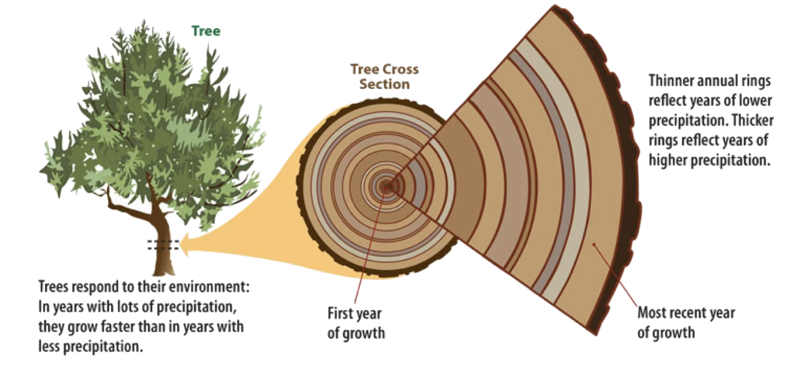
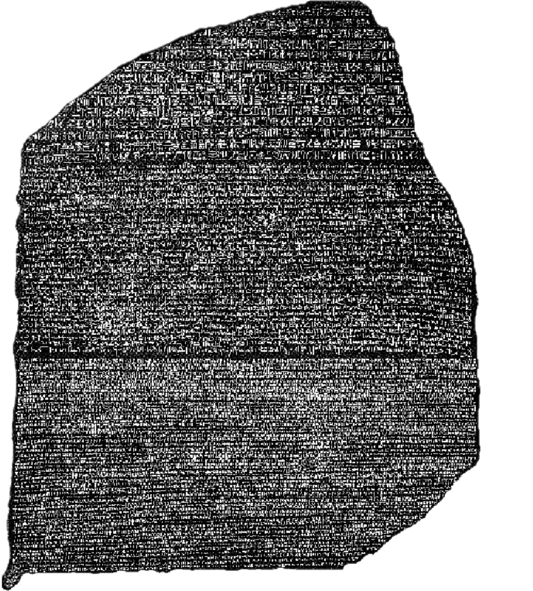

## Question:

::: {style="margin-top: 50px; font-size: 1.5em;" .incremental}
- Since:

  - language doesn't fossilize,
  - audio recording technology is only about 150 years old,
  - printing is only about 586 years old,
  - and the oldest known writing of any kind is ~5,000 years old,

- how far back in time do you think we can reliably know about the evolution of language?
:::

## How far back?

::: {style="margin-top: 125px; font-size: 1.5em;" .incremental}
- Historical Linguists are pretty confident that we can use our understanding of how language works to look deep back into the mists of time.
- For one language family, we can go as far back as 4,500 BCE to 2,500 BCE during the Late Neolithic to Early Bronze Ages!
- Today and Friday, we're going to try to show you how!
:::

## Ling Link

| **Language A** | **Language B** | **Language C** | **Language D** |   **gloss**   |
|:----------:|:----------:|:----------:|:----------:|:---------:|
|     due    |     bi     |     dó     |     doi    |   *two*   |
|    naso    |    sudur   |    srón    |     nas    |   *nose*  |
|  fratello  |    anaia   |  bráthair  |    frate   | *brother* |
|    padre   |    aita    |   athair   |    tată   |  *father* |
|    sette   |    zazpi   |   seacht   |    sapte   |  *seven*  |
|  orecchio  |   belarri  |    cluas   |   ureche   |   *ear*   |
|    dieci   |    hamar   |    deich   |    zece    |   *ten*   |

:::: {.inline-fragment}

- Which language is *least* related to the others? &nbsp;

::: {.fragment}
 **Language B**
:::

::::

:::: {.inline-fragment}

- Which two languages are *most* closely-related? &nbsp;

::: {.fragment}
 **Languages A & D**
:::

::::

## Ling Link

| **Italian** | **Basque** | **Irish** | **Romanian** |   **gloss**   |
|:----------:|:----------:|:----------:|:----------:|:---------:|
|     due    |     bi     |     dó     |     doi    |   *two*   |
|    naso    |    sudur   |    srón    |     nas    |   *nose*  |
|  fratello  |    anaia   |  bráthair  |    frate   | *brother* |
|    padre   |    aita    |   athair   |    tată   |  *father* |
|    sette   |    zazpi   |   seacht   |    sapte   |  *seven*  |
|  orecchio  |   belarri  |    cluas   |   ureche   |   *ear*   |
|    dieci   |    hamar   |    deich   |    zece    |   *ten*   |

---

## Attendance Question

::: {style="margin-top: 50px; font-size: 1.5em;" .incremental}

**On canvas**: Two of the languages we just examined were most similar. One language was least like the others.  What was the fourth language?  Which language was *not* one of the in-class answers?

:::

## Language and Evolution

::: {.incremental}

- Humans acquired language ability during the prehistoric past (possibly *hundreds* of thousands of years ago)
  * _Homo sapiens _ (~300,000 years ago) or even earlier ancestor  _Homo erectus_ (~2,000,000 years ago)
  * The mythical Bible story of Tower of Babel (Genesis 11:1-9) shows us that humans have been wondering where language (and languages) come from since at least the Bronze Age 
  * What we do know is that it is a quintessentially human phenomenon!

:::

## Language and Evolution (cont.)

::: {.incremental}

- Why language? Why then?
  * Likely, Language, as a human ability, facilitated hunting (working as a team against larger, faster, more numerous prey) or reproduction (or both!)
  * Must have built on an already-evolved ability to think symbolically
  * The evolution of how we use sounds is closely tied to our physical abilities to create and hear sounds
  * Related to the same human abilities that would give us cave paintings!

:::

## 



## Fact: We don't actually know how language evolved

- We can make educated guesses based on evidence from the fossil record
- For some, the idea that we could ever know is so absurd that formal discussions of the origin of language has been banned at various points in history by different entities
- Probably we will never really know what the first words were, where they were spoken, or precisely why
- But thinking about language evolution is not a waste of time *because* thinking about language as an innate human ability has led to a pretty useful insight:

## Human languages are human languages!

::: {style="margin-top: 50px; font-size: 1.5em;" .incremental}

- Since humans everywhere are basically the same (anatomically, cognitively, vocally, etc.)
- let's assume that what we understand about how language words *today* can let us **reconstruct** how languages have worked throughout human history

:::

## So what *can* we know?

* What do linguists do to try to understand how languages have changed over time?
* This is called  _historical linguistics_ \!
  * Describe how specific languages have changed through time
  * History of languages and how they are related
  * Theories about how and why languages change
  
::: {.notes}

How has English changed since it first became a language? What languages is English related to? Why would a person want to speak differently than their parents?
 
:::

## There are two ways to think about time

## Synchronic vs. Diachronic

- **Synchronic**(like the bark, the living tree): Synchronic linguistics attempts to understand how language works *right now* looking at a vast array of sources of data: experiments, surveys, dialectology, interviews, even introspection

- **Diachronic** (like examining the rings): Diachronic linguistics attempts to look back through time, comparing evidence we have today to reconstruct what earlier forms must have existed to become what we see today!

## Comparing modern forms lets us understand older relationships

| **Italian** | **Basque** | **Irish** | **Romanian** |   **gloss**   |
|:----------:|:----------:|:----------:|:----------:|:---------:|
|     due    |     bi     |     dó     |     doi    |   *two*   |
|    naso    |    sudur   |    srón    |     nas    |   *nose*  |
|  fratello  |    anaia   |  bráthair  |    frate   | *brother* |
|    padre   |    aita    |   athair   |    tată   |  *father* |
|    sette   |    zazpi   |   seacht   |    sapte   |  *seven*  |
|  orecchio  |   belarri  |    cluas   |   ureche   |   *ear*   |
|    dieci   |    hamar   |    deich   |    zece    |   *ten*   |

## Diachronic evidence might look like this:

## Some First Principles for Diachronic Linguistics

::: {.incremental}

- Language is arbitrary
- Language is constantly changing
- Changes happen in knowable, predicatable ways
- Once a change starts, it tends to spread through the entire language
- Some changes are so unlikely (so unlike the way language works) that they never happen on their own (e.g. two unrelated languages whose speakers have never met randomly becoming more similar to each other)

:::

# Do living languages always change?

## Vocabulary – words can change

::: {style="margin-top: 50px; font-size: 1.5em;" .incremental}

  * What’s a popular \(and clean\) slang term that you use with your friends that old people wouldn’t understand?
  * Can you name any slang terms your parents\, grandparents\, etc\. use that mark them as old people?

:::

## Phonetics/phonology – sounds can change

::: {style="margin-top: 50px; font-size: 1.5em;" .incremental}

  * __Southern__ :  _high\, pie\, ride\, slide_
  * __Boston:__   _Park your car in Harvard Yard\!_
  * __Northern Cities: __  _mad\, bad\, glad_

:::

## Semantics – meanings can change

::: {style="margin-top: 50px; font-size: 1.5em;" .incremental}

- ‘starve’:
    * _Vpon_  _ a _  _cros_  _ _  _oure_  _ _  _soules_  _ for to _  _beye_  _;_
    * _   First _  _starf_  _\, and _  _ros_  _\, and sit _  _yn_  _ _  _heuene_  _ a\-_  _bove_  _\._
    * Upon a cross our souls for to be;
    * First  __died__ \, and rose\, and sit in heaven above
    * \(Chaucer  _Troilus & Criseyde_ \, 1374 ad\)
:::

## Morphology & Syntax – word endings and order can change

::: {style="margin-top: 50px; font-size: 1.5em;" .incremental}

  * Shakespeake’s  _Romeo & Juliet_ :  *Wherefore art though Romeo?* _meant_:
  * "Why are you named 'Romeo'?" / WHY do you have to be a stinking Montague?

:::

## Another Morphology & Syntax example:

- Chaucer’s Canterbury Tales:

> Whan that Aprille with his shoures soote
> The droght of March hath perced to the roote
> And bathed every veyne in swich licour
> Of which vertu engendred is the flour;

- When April, with its sweet showers,
- The drought of March has pierced to the root
- And bathed every plant's vein in such liquid
- By which art flowers are created

:::

## We can study the rings

- We can look back through the evidence
- By examining living languages, 
- Or (if we're *very* lucky) by looking at written records

{width=45% .absolute bottom=0 right=0}

## Language Families

* Linguists examine languages as part of what are called  __language families__
  * Ex\. Germanic\, Romance\, Slavic
  * The idea is that every language descends from another language\, which\, in turn\, descended from another language
  * Think of it like a family tree\!
* Over time\, dialects can change so much that they become  _mutually unintelligible_
  * In other words\, speaker of dialect A can’t understand a speaker of dialect B
  * When this happens\, the two dialects can be considered new languages unto themselves

## Language relatedness

## Language Relatedness (cont.)

* The idea is that\, like you have received traits \(e\.g\.\, hair/eye color\) from your parents\, so too do languages receive traits from their parent languages\!
  * How do we know? Couldn’t it be borrowings or chance?
  * Look at the core vocab\!
* There are more than 100 language families\, and most of the world’s languages are classified into one of them
  * Romance \(pictured here\) is a branch of the Proto\-Indo\-European tree

## Proto Languages

* A  __proto\-language__  is a postulated ancestral language from which a number of languages are believed to have descended by evolution\, forming a language family
  * __Attested __ = languages we have evidence for their existence \(e\.g\.\, Latin\)
  * Proto\-languages are usually  __unattested__ \, or partially attested at best
  * They are reconstructed by way of the  __comparative reconstruction__
* Languages like “Proto\-Indo\-European” are  __reconstructed languages__
  * That is\, we have no direct record of it\, but we use the daughter languages to attempt to understand what language would have been like\!

## What’s with the “proto” stuff?

* __Comparative reconstruction__ \, as its name suggests\, is about comparing different languages to find their similarities and differences
  * We reconstruct the ancestor based on the attested daughter languages
  * Requires knowledge of phonology\, morphology\, lexicon\, etc\.
  * BUT – we can try a simple example\! Check out these words for “father”\.

## Comparative Reconstruction

| Modern Language | Meaning | Modern Language | Meaning |
| :-: | :-: | :-: | :-: |
| English | father | Gothic | faðar |
| German | Vater | Old Icelandic | faðir |
| Swedish | far | Old English | fæder |
| Dutch | vader | Old Saxon | fadar |
| Icelandic | faðir | Old High German | fater |
| Norwegian | far |  |  |
| Faroese | faðir |  |  |
| Danish | far |  |  |
| North Frisian | faaðer |  |  |

## What’s next?

Come to lecture Monday for the very first SPOTLIGHT LECTURE \(led by Jules\)

Observation Notes \#1 due Friday\!

Quiz 2 Friday\! = Go to recitation\!

