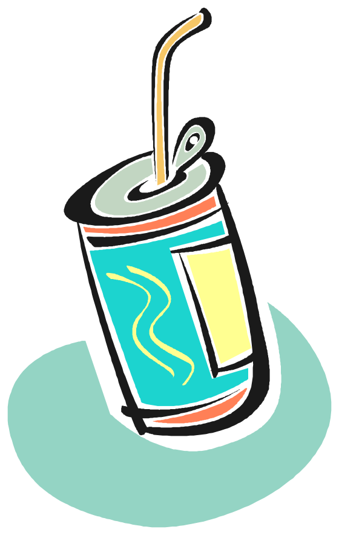

## This course is structured around questions

| What is linguistics? |	| How do kids learn to talk? |
|----------------------|--|----------------------------|
| What is language? |	| How does bilingualism work? |
| How many languages are there? |	| Why is it hard to learn other languages? |
| Where does language come from? |	| How is writing different from speaking? |
| Spotlight Lecture: What is linguistics research? |	| 🤷 |
| What is a word? |	| Why can’t Siri pronounce my name? |
| How do words get their meaning? |	| How do computers help with language? |
| Is slang legit? |	| Are chatbots real? |
| Why are some words “bad words”? |	| Spotlight lecture: How do we find relevant linguistics sources? |
| Who says “pop” and why? |	| Are actors good at dialects? |
| Where do dialects come from? |	| Can you make your own language? |
| What is the prettiest language? |	| Do animals use language? |
| Spotlight lecture: What methods and ethics of inquiry are used? |	| Who really uses this stuff? |
	| Why Linguistics? | | |
	
: {.table .table-striped .table-hover}

## Making questions approachable

### Week 1 lecture and recitation: What is linguistics?

::: {class="query"}

- what is language?
- what types of language are objects of inquiry?
- what can language variation look like?
- how do/can linguists and non-linguists talk about language?
- what do people believe about linguistic rules/expectations?

:::

## Goal #1: assignment prep

{.absolute top="100" right="0"}

:::: {.columns}

::: {.column width="60%"}

- Prepare for future projects in the course
- **Midterm project**: data collection
- **Final project**: thinking about data collected
- Ask a research question ⟶ Spotlight 1  linguistics research)
- Propose methods ⟶ Spotlight 2 (methods and ethics)
- Find a relevant source ⟶ Spotlight 3 (finding sources)

:::

::: {.column width="40%"}

&nbsp;

:::

::::

## Goal #2: being curious

{.absolute top="100" right="0"}

- Move away from “Getting Started”
- How can I apply course concepts?
- What’s involved in starting (linguistics) research?
- How do I use concepts to make richer observations?
- What are the qualities of a fruitful (linguistics) research question?
- How could I turn observations into questions?

---

## Ling-link...

:::: {.columns}

::: {.column width="60%"}

- Spend 1-2 minutes jotting down questions(s) that you’ve had about language
- General (“do animals have language?”) or specific (“why does my grandma say  _warsh_  _?_ ”)
- Spend 2-3 minutes talking with your neighbor(s) about your inquiries
- Have you all had similar questions or ideas?
- How might you go about answering your question?

:::

::: {.column width="40%"}

:::

::::

## Our Questions

> "Why do some languages have words for concepts that other languages don’t even have a meaning? "

> "Why can’t people understand certain accents?"

> "I have always wondered what english sounds like to non english speakers"

> "Do animals have language "

> " If someone is bilingual, what determines which language they think in?"

> "How do slang words develop and who comes up with them?"

> "After moving to another state how does language and accents change?"

> "why does my dad say “wuder” and i say “water” if we grew up in the exact same area?"

> "Why do we yell when we feel an intense emotion?"

> "How fast does language evolve over time"

> "Who or what made the alphabet and how did it become a universal thing that everyone agreed upon"

> "Why do singers from other countries often sound like Americans when they sing?"

> "What are the roots of different accents?"

> "Why do some people say their a’s differently for example like bad "

> "What causes accents to happen, and stay over time? "

> "How did/do dialects first form?"

> "how does someone’s language change when they move regions and is that called something "

> "How can one overcome an accent when learning and communicating in a different language "

> "Do we think certain animals can communicate to an advanced degree?"

> "why is silence sometimes considered a type of language?"

> "How did the Appalachian accent start? "

> "How did we get so many languages and why are some so similar but still different "

> "Why are some people who are bi-lingual speak with accents and some don’t? "

> "Why do my older family members say warsh and torlet"

> "How do new languages form "

> "Why does every individual have a unique way of speaking? "

> "Why do people use “I seen” instead of “I saw”?"

> "What do u think has been the number 1 change in language over time? "

> "Why do people in the south say yall but people in the north do not?"

> "how can me and gang make our own language "

> "why are there some languages that are disappearing "

> "Why are there so many rules that go into every different language?"

> "Why is it harder to learn some languages than others?"

> "How do babies learn to think in words if they can’t speak"

> "Is it normal to think in your own voice? "

> "Why do we as humans take certain words so personal? "

> "why does my grandma say hubbub? "

> "Why is it when I say bag, I am pronouncing it as beg?"

> "Can you accent change if you were born in the South and then moved up North? "

> "why do different parts of the world adapt to language differently? "

> "How are certain words more popular in certain regions, how did they originate to that distinct place and then stay?"

> "What’s the most common American accent from a non-domestic POV? Why is this the first one that comes to mind?"

> "If you speak two languages and grew up with both which one do you think in?"

> "Do animals think the way we do? "

> "Is there a right and wrong way of saying certain things in certain places "

> "what age to babies actually start thinking in a language (or just thinking in general)"

> "Can animals communicate with other animal species?"

> "Why are accents so different even in places super close to each other? "

> "Why do accents vary based on where you’re from?"

> "Why do people say crayon differently? "

> "How does a baby know to say just “mama”, instead of “say mama”?"

## Questions come from observations

“I talk differently when communicating to my friends than my professors”
: _How does language influence identity?_

“People complain about texting ruining how people speak”
: _How do computers impact modern language?_

“[company] said that Southerners sound unprofessional when they talk”
: _How do people feel about how others speak?_

“People have vastly different experiences but can understand each other”
: _How can people process speech?_

## How would we find out?

::: {.fragment .fade-right }

:::

::: {.fragment .absolute .fade-right top="45%" right="0"}
### Research!
:::

::: {.notes}

Imagine that you have questions like the ones that you have on the board
How could we know?
Commit to an answer

Look it up - many questions for which we know the answer but so many more that we don’t know the answer to

:::

## What's involved in research?

- Finding plausible explanations for questions
- _Many_  ways to approach doing research

::: {.fragment}

| Asking a research question | How do I ask a question? |
|------|------|
|                            | How do I know what questions I can be asking? |

: {.lightbluebox tbl-colwidths="[40,60]"}

:::

::: {.fragment}

| Selecting an appropriate method | What are methods? |
|------|------|
|                            | How do I do research ethically? |

: {.mediumbluebox tbl-colwidths="[40,60]"}

:::

::: {.fragment}

| Contextualizing | How do I find resources to support my research? |
|------|------|
|   |   | 

: {.darkbluebox tbl-colwidths="[40,60]"}

:::

::: {.notes}

Planning ahead

:::

---

## Qualities of solid research questions {.nonincremental}

{.absolute top="35" right="0"}

- Based on previous research
  - Why: connect to other studies
- Are practical
  - Why: need to be doable
- Are specific
  - Why: more specific = more precise answers

::: {.notes}

Coherent collection of research helping us understand phenomena happening in the world that our field studies’

Time and money and possible at all

More targeted = more specific

:::

## Where does/can research start?

{.absolute bottom="0" right="0"}

:::::::: {.columns}

::: {.column width="60%"}

Something that we observe, read about, find interesting, find confusing, find controversial, etc.

::::: {style="font-size: 70%;"}

For the final project: midterm data + semester content 

:::::

> “I noticed that someone uses  _bubbler_  to refer to a water fountain... I wonder what other words might vary between people...”

> “I heard someone claiming that  _bubbler_  and  _water fountain_  refer to the same thing, but I wonder if other people think about them differently...”

:::

::::::::

## Starting with observations (from Recitation 1)

:::::::: {.columns}

::: {.column width="45%"}

Other examples of regional variation

 - Pop, soda, coke
 - lightning bug, firefly
 - Roly poly, potato bug, pill bug

:::::: {.fragment}

Including different pronunciations

::::::

- Wash vs. warsh
- pin = pen, pin ≠ pen
- Caramel (2 vs. 3 syllables)

:::

::: {.column width="10%"}

:::::: {.fragment style="font-size: 200%;"}

 ➙ 
 ➙
 ➙ 

::::::

:::

::: {.column width="45%"}

:::::: {.fragment}

People speak differently

- In what ways?
- Why?
- What effects does this have on how people interact?

::::::

:::

::::::::

## Observations ➙ questions {.nonincremental}

### Too broad:

::: {.nonincremental}

- How does regional identity influence lexical variation?
- ( what _type_ of lexical (=word) variation? what kind of region? )

:::

### ☞ More optimal:

::: {.nonincremental}

 - _where, exactly, do people use different words for a carbonated beverage?_
 - _how do people there feel about the word?_
 - _why do less standard forms persist?_

:::

{.absolute width="25%" bottom="0" right="0"}

## Attendance Question 9-14 (lecture day 6)

::: {style="margin-top: 200px; font-size: 150%;"}

What object with regionally varying names are we using in our example research question? Or, what is the object featured in the example research question on the previous slide?

:::

## 1. Based on Previous research

:::: {.fragment}

{.absolute top="100" left="100"}
::::

:::: {.fragment}

{.absolute top="225" left="250"}
::::

:::: {.fragment}

{.absolute top="350" left="400"}
::::

:::: {.fragment}

{.absolute top="475" left="550"}
::::

:::: {.fragment}

{.absolute top="600" left="700"}
::::

::: {.notes}

why important

:::

##



::: {.notes}

Soda vs soder

I say it wrong, I say bag (raised /æ/), most people in minnesota do

:::

## 

{.absolute width="80%" right="0"}

:::: {.fragment .absolute bottom="100" left="150"}

■ Soda

■ Pop

■ _Coke_

■ Soft drink

 ➙ ➙ ➙ 
::::

## 2. Practical and 3. Specific

{.absolute top="50" right="0"}

- Are there feasible methods for testing this?
- If I needed to, could I use a specific method for answering?
- What methods are available?
- Is this narrowed enough to be doable?
- Can I find methods that will let me adequately answer this question?
- How much time do I have to research this question?
- Would it be easier for me to answer this question if I broke it down into several smaller questions?

## 

## Why examine variation in words for fizzy beverages?

“human languages are structured systems for making articulated thoughts fully explicit both internally (mentally) and externally (in a form perceptible to other humans)” (Pullum, p. 3)

::::: {.fragment}

Language variation, then...

:::::

- reflects historical and cultural trends
- is personal and creative
- is natural and “normal”

::::: {.fragment}

The ways we use language express information about who we are

:::::

::::: {.fragment}

Understanding/acknowledging others’ motivations for using language differently can make us more effective and empathetic communicators

:::::

{.absolute width="200px" bottom="350" right="180"}

::: {.notes}

Coke ATL

:::

## What'd we talk about?

:::: {.columns}

::: {.column width="60%"}

- Linguistics research asks questions across a span of topics
- Regional variation for lexical items = one of so many ways to answer a question about language
- Appropriate research questions are 
  - Connected to previous research
  - Practical and about specific topics
- _Questions start with observations_

:::
::::

{.absolute width="35%" bottom="200" right="0"}

## What’s next?

- Wednesday: What is a word? + Pullum chapter 3 (“Words, Meaning, and Thought”)
- Friday: recitation and Quiz 3
- The more distant future: 2) methods of inquiry and 3) finding linguistic sources

