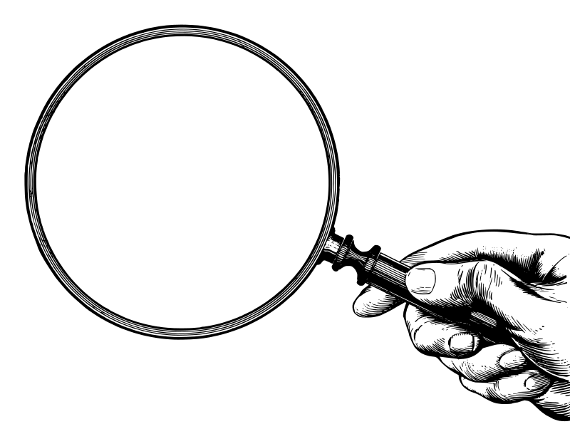

## Ling Link (slide 1 of 4)

::::: {.columns}

::: {.column width="45%"}

:::

::: {.column width="55%"}

- We're going to listen to part of **Espresso** together (note: contains expletives)
- Please observe her use of language:
  - Can you identify any innovative ways she is using words?
  - What is innovative about it?
  - How do you know what she means?

:::

:::::

##



## Ling Link 3 minutes (slide 3 of 4)

::::: {.columns}

::: {.column width="50%"}

- Please discuss in pairs or small groups:
  - What did you observe?
  - How do you know it was innovative?
  - How do you know what she means?

:::

::: {.column width="50%"}

:::

:::::

## Ling Link Related Media (slide 4 of 4)

[https://www\.azlyrics\.com/lyrics/sabrinacarpenter/espresso\.html](https://www.azlyrics.com/lyrics/sabrinacarpenter/espresso.html)
: Lyrics for Sabrina Carpenter’s “Espresso”

[https://www\.youtube\.com/watch?v=4h0a1NCeC14](https://www.youtube.com/watch?v=4h0a1NCeC14)
: Audio for Espresso

[https://www\.them\.us/story/sabrina\-carpenter\-espresso\-lyrics\-analysis\-meaning\-explained](https://www.them.us/story/sabrina-carpenter-espresso-lyrics-analysis-meaning-explained)
: Neat bonus story

## Thanks to Stella!

- Enormous thanks to Stella for running our first SPOTLIGHT lecture on “What is linguistics research?”
  - Research = finding answers to questions
  - Good research questions are…
    - Based on previous research
    - Practical
    - Specific
  - Why do we care?
  - Be curious\!

{.absolute width="40%" right="0" bottom="0"}

## Previously in Linguistics 211

::::: {.columns}

::: {.column width="50%"}

:::

::: {.column width="50%"}

- Languages are “structured systems for making articulated thoughts fully explicit”
- Focus on the human capacity for language
- There are ~7,000 human languages
- The study of language change over time is  __historical linguistics__
- All languages change\!
- Language families

:::
:::::

##

::: {.r-fit-text}
What is a word?
:::

## What is language _made of_?

::::: {.columns}

::: {.column width="40%"}

:::

::: {.column width="60%"}

- Next we'll look at the **bits and pieces** that make up language
- Our first question today is: what is a word?
  * We all agree that languages have words
  * At 20, Americans know about 42,000 words on average [@BrysbaertStevensManderaKeuleers2016]
* But how do we  _define_ what 'a word' is?
* Does that seem like a silly question?

:::
:::::

:::::::: {.notes}

Is 'Mountain Dew' (beverage) one word or two?  is Mountain Dew it for ya the _same_ word?
::::::::

## What is a word?

* “The smallest separate piece of a language that all by itself will have a meaning\.”

|     |     |     |
|-----|-----|-----|
| red | class | work |

::::: {.fragment}

* But what about…

|     |     |     |
|-----|-----|-----|
| red -ness | class -es | work -ing |
| red -den | class -y | work -aholic |
| redneck | classroom | workhorse |

: {.striped .hover}

:::::

::: {.notes}

Definition from (Elgin, “Colorless Green Ideas”)

:::

## Words

- How about: the smallest meaningful unit that can occur by itself?
- But the following words almost never occur alone:

|     |     |     |
|-----|-----|-----|
| the | a | an | on |
| of | with | will |

- Do they have meaning?

## Don't confuse _language_ with _writing_

::::: {.columns}

::: {.column width="50%"}

{ width="100%"}
:::

::: {.column width="50%"}

- “A word is the sequence of letters between two blanks\.”
- But language != writing
- And there are no pauses between spoken words!
- What about languages with no writing systems?
- Or writing systems with no spacing?

:::

:::::

::: {.notes}

Ancient Latin Text

:::

## What is a word? (cont.)

| Mandarin    | German      |
|-------------|-------------|
| Almost entirely one syllable: | Many syllables per word   |
| **能** _néng_    | _Nahrungsmittelunverträglichkeit_
|  'be able'                | ‘food intolerance’ |
| **周**  _zhou_  | _Sprachwissenschaftler_ |
| ‘week’ | linguist |

##



## Attendance Question 9-16 (lecture day 7)

::: {.r-fit-text}

Our attendance question for today is on canvas and the access code is on the whiteboard.

:::

## To know a word

::::: {.columns}

::: {.column width="65%"}

- Knowing a word requires (at least) four kinds of knowledge:

  - __Phonetic__ / __phonological__  knowledge
  - __Syntactic__  knowledge
  - __Morphological__  knowledge
  - __Semantic__  knowledge

:::

::: {.column width="35%"}

:::
:::::

## What is phonetics?

- __Phonetics__  is the study of the sounds in a language
  - __Articulatory phonetics__  focuses on the human vocal apparatus and describes sounds in terms of their articulation in the vocal tract
  - __Acoustic phonetics__  uses the tools of physics to study the nature of sound waves produced in human language
  - __Speech perception__ uses the tools of psychology & psychoacoustics to study the nature of listeners' experience of language

## What is phonology?

- __Phonology __ is the study of the  _systems_  of contrastive relationships among the speech sounds of different languages
  - Why do some languages have such different sets of sounds?
  - Includes sound categories but also phonotactics, syllables\, stress\, intonation, etc\.
  
## What is syntax?

* **Syntax** is the study of how words can be combined to form larger units of meaning in different languages
  * It’s all about how words group together (_constituency_), hierarchical structure, and constraints on how those can happen
  * It is easy to see that some words have some things in common; they share certain characteristics and behave similarly\.
* But in order to talk about structure\, we need to know a little about…

## Syntactic information

* __Syntactic Categories__ are categories of words based on similar functions, meanings, and forms
  * AKA  __lexical categories__ ,  __word classes__ ,  __parts of language/speech__
  * Major classes: Nouns\, Verbs\, Adjectives\, Adverbs
  * Minor classes: Pronouns\, Determiners\, Prepositions\, Auxiliary verbs\, Conjunctions
  
## Morphology

::::: {.columns}

::: {.column width="50%"}

:::

::: {.column width="50%"}

- To explore morphological knowledge\, we need the subfield of  __morphology__ \, which is the study of word formation
- In morphology\, we study a word’s component parts and internal structures
  - How many parts are there in a word?
  - For example\, how many parts are in the word  _friendliness_ ?
  - These parts are called  __morphemes __ – the smallest meaningful unit in language \(that is\, the lowest level a word may be broken down into and still express some meaning\)

:::
:::::

## Morphological Rules

- The operations that create and modify those parts and internal structures are called **morphological rules**
- Remember\, grammar = rules\, and all languages have rules\!
- Example rule in English:
  - How do we make a noun into an adjective?
    * Smell \+ \-y = smelly
    * Cat \+ \-like = catlike
    * Man \+ \-ly = manly
- Morphological rules can create new words in productive, predictable ways\!

## Morphological information

## What is semantics?

- Semantics is the study of linguistic meaning
  - Deals with the systematic ways in whcih languages structure meaning, especially in words and sentences
  
  - There are three main types of meaning:
    - **Denotational meaning**: (aka 'linguistic meaning') The literal thing, action, idea, syntactic information that the word points to in our minds
    - **Affective meaning**: emotional connotation attached to words and utterances
    - **Social meaning**: How we identify certain social characteristics of speakers and sitations (e.g. *y'all*, *pop/soda/coke*, *whom*)

## What’s next?

{.absolute width="30%" bottom="0" right="0"}

- Come to lecture Monday for “How do words get their meaning?”

- Get started on Observation Notes \#2 \(due February 14\)\!

- Quiz 3 Friday\!

## References
