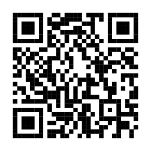
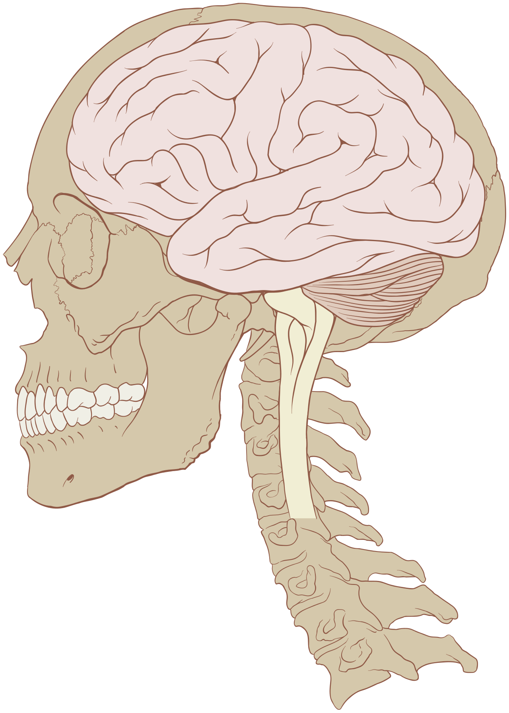
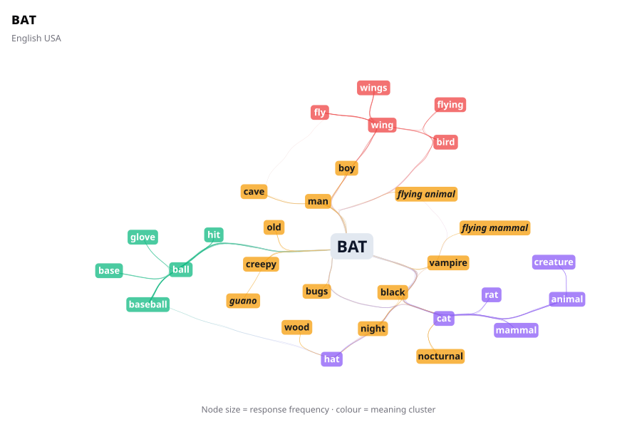
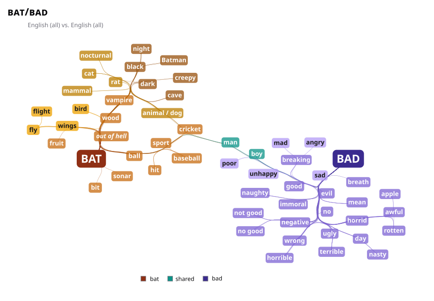
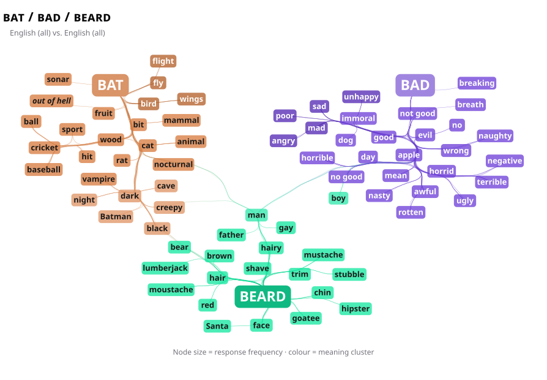

##

:::: {.r-fit-text .absolute top="300"}

Where does authority come from in language?

::::

::: {.notes}
Many of you, in observation notes, still want to call some kinds of language "bad grammar" and other kinds of language "good grammar".

:::

## Authority depends on context

::: {.incremental}

- One of the biggest problems with **prescriptivism** is the way it ignores the social and affective meanings of language
- When we use a word, we are not only attempting to share its **denotation** with the listener
- We also choose words for their **connotations**
- And we choose words, and sounds, and syntactic structures, etc. that are **appropriate to the social situation**

:::

## Authority depends on context (cont.)

- What counts as "good" or "bad" language has to depend on:
    - who is saying it?
    - who is listening?
    - where are you?
    - what are you trying to accomplish?

## Ling Link

::::: {.columns}

::: {.column width="50%"}

[https://www.whatiswiki.com/gen-z-slang-dictionary](https://www.whatiswiki.com/gen-z-slang-dictionary)

- Do you hear friends use these?
- Do you use them?
- Decide as a group which are still okay and which are over.
- Which would be worst for your professor to use?

:::

::: {.column width="50%"}

```{r}
library(qrcode)
floop <- qr_code("https://www.whatiswiki.com/gen-z-slang-dictionary/")
generate_svg(floop, "images/qr-code.svg")
```
{width="100%"}
:::

:::::

##

::: {.incremental}

- Slang is **all about** authority!  But not in a top-down, mythical "good grammar" sort of way
- Slang exists as a way for groups to define themselves (generations, military, subcultures, etc.)
- And by defining who *we* are, we also get to define who is **not** *us*
- When we say language has **social** meaning alongside its literal denotation and affect, this is what we mean!
- **Language is a social practice** (and anyone who tells you that slang is 'wrong' or 'uneducated' simply does not understand what language is.)

:::


## Gen Z is the authority on Gen Z slang

::: {.incremental}

- Each generation rejects anything older people said that still *seems* age coded:
  - Millenials: the pause, adulting, stan, lit, mood, salty, I can has
  - Gen X: stoked, hella, clutch, whack, bogus, fly, fresh, janky, rad
  - Boomers: groovy, far out, square, righteous, drag, fuzz (meaning police)
- Each generation also tends to reject anything people younger than them say that *seems* age coded:
  - Gen Alpha: skibidi, brain rot, rizzler, sigma, mog?, glaze?

:::

##

:::: {.r-fit-text .absolute top="250"}

If a slang term escapes containment, it becomes cringe.

::::

[and fades out of use]{.fragment .absolute top="330" right="0"}
[(yolo, cheugy, on fleek, 6-7, woke, others?)]{.fragment .absolute top="390" right="0"}
[**why?**]{.r-stretch .fragment .absolute top="470" right="600"}

##

::::{.r-fit-text .absolute top="250"}

Because slang can't serve its social function if outsiders use it.

::::


## But slang is also an important way that words enter the lexicon

[art, artsy, awful, bad-mouthing, banter, belch, bellhop, bender (drinking), bet (wager), bingo, bomb (fail), bootcamp, bootleg, booze, bouncer, bratty, brunch, bubble, bully, buff, bungee, burp, cheesy, chum, clobber, clueless, cool, cop, cuss, ditch (v), **divvy**, dork/dorky, dreamy, **exam**, fake, fan, fave, flick, flog, fluke, flunk, frat, gal, gawky, geek, grouchy, growler (beer bottle), gunky, **gym**, hack (cope), hairy (difficult) heist, hellacious, **hello**, hit (kill), hunch, hyper, jay walking, jinx, job, jock, joystick, kid, lag (v), meme, misfit, mob, nerd, nuke, **ok**, OJ, pal, patrol, pec (muscle), pinpoint, poke, **pub**, rave, scram, sender, sham, shenanigan, shuffling, slang, stoner, super, suss out, swag, teenager, varsity, wimp, wonky, etc.]{.r-stretch-text}

##

:::: {.r-fit-text .absolute top="300"}

The heck is a **lexicon**?

::::

## Mental Lexicon

{.absolute right="0" width="30%" bottom="0"}

- All of this information about words is stored in our **mental lexicon**
  - Structured by pronunciation & meaning (both)
  - Includes:
    - lexical category
    - how it works in a sentence
    - pronunciation
    - meaning(s) (denotation, affect, social)
  - Words in our mind are linked to other related words

## {auto-animate=true}

{.absolute left=0 right=0 bottom=0 top=0 height="90%" style="margin: auto auto;"}

## {auto-animate=true}


{.absolute left=0 right=0 bottom=0 top=0 height="90%" style="margin: auto auto;"}

## {auto-animate=true}

{.absolute left=0 right=0 bottom=0 top=0 height="90%" style="margin: auto auto;"}

## Language is rich with social functions

{.absolute right="0" bottom="0" width="40%"}

- **Compare**: You're having dinner with your significant other's family for the first time:

  - Q1 – Can you pass all of your classes this term?
  - R1 – Yes, I believe so!

- but:

  - Q2 – Can you pass the salt?
  - R2 – Yes, I believe so!

---

## Pragmatics

- __Pragmatics __ is the study of language use\, in particular\, the relationship among syntax\, semantics\, and interpretation in light of the  _context of the discourse_
  - Discourse = sequence of language\, joined in situation
  - Context = where we are\, what came before\, etc\.
  - Differs from  __semantics __ in that the focus there is on meanings of words\, sentences\, and phrases  _in isolation_  _\, without regard to contextual information_


## Competence

Being a competent speaker of a language requires all three kinds of meaning:

- an ability to understand the literal meaning of an utterance (like "can you pass your classes?")
    - we call this **grammatical competence**

- an ability to understand the affective and social meanings of an utterance (like "can you pass the salt?")
    - we call this **communicative competence**


## Sociolinguistics

- Together with pragmatics and linguistic anthropology, **sociolinguistics** is the subfield of linguistics that studies these affective and social functions of language
- Language is a social practice
- And, as social creatures, much of our social identities are negotiated and maintained _through_ language


## Language is not just for communication of ideas


- People have at their disposal an entire  __linguistic repertoire__
- (the set of language varieties exhibited in the speaking and writing patterns of a speech community)
- We adjust to the speech situation = who\, what\, where\, when\, why\, how\, etc\.
- This is communicative competence!
* Languages \(and dialects\, styles\, registers\, etc\.\) can differ in vocabulary\, phonology\, grammar\, semantics\, etc\. across a variety of speech situations


## What’s next?

::::: {.columns}

::: {.column width="40%"}


:::

::: {.column width="60%"}


- Come to lecture Monday for “Why are some words bad words?”
- Observation Notes #2 = due Friday * 11:59pm
  - We saw some AI this time and called it out.
  - This is not cool. Check the syllabus. NO AI on this assignment, none.
- Quiz 4 Friday!
