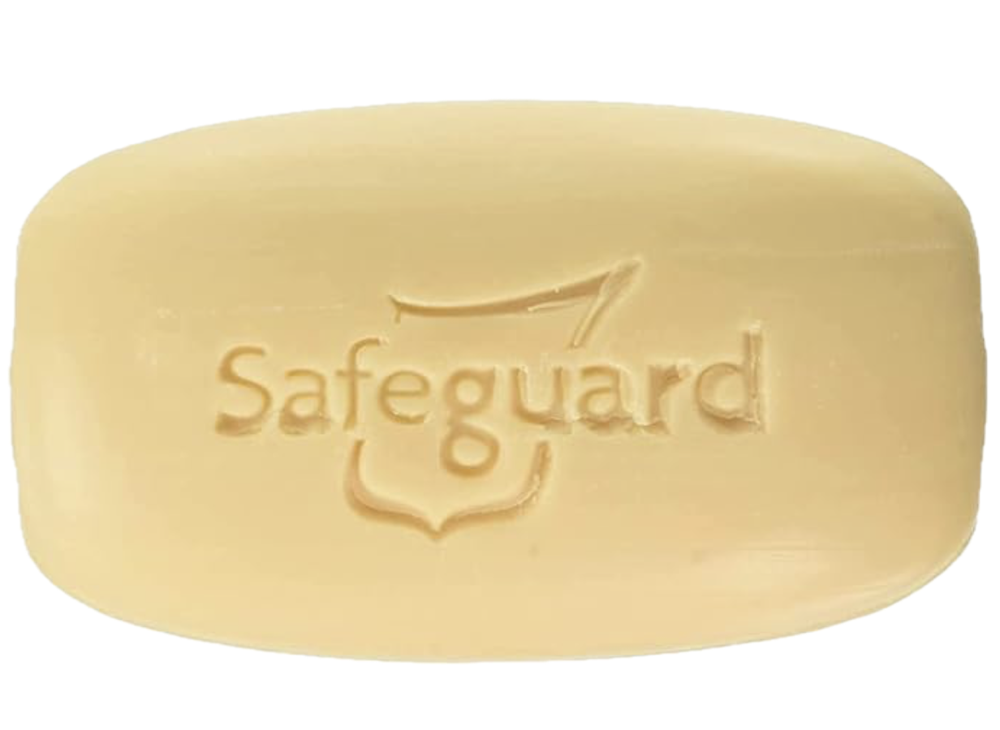
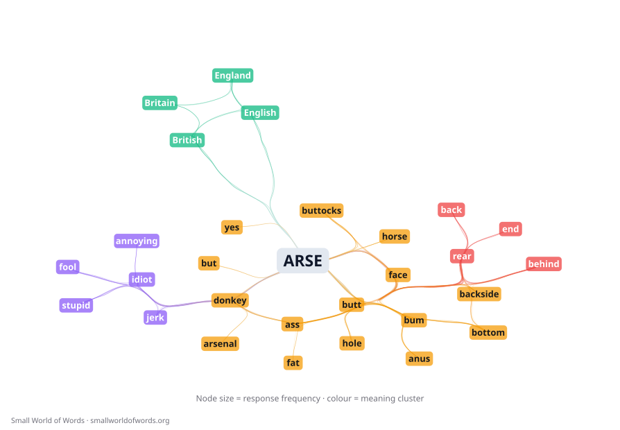
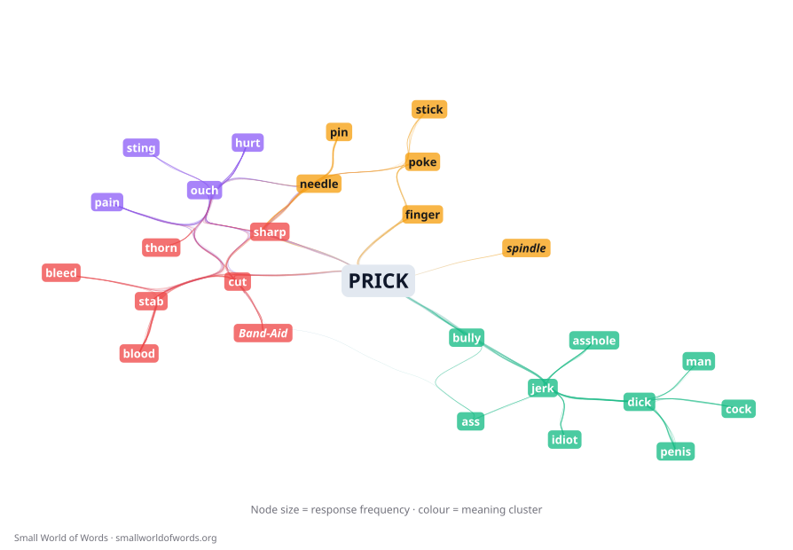
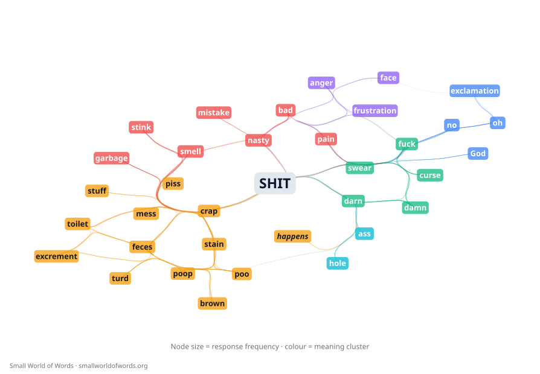
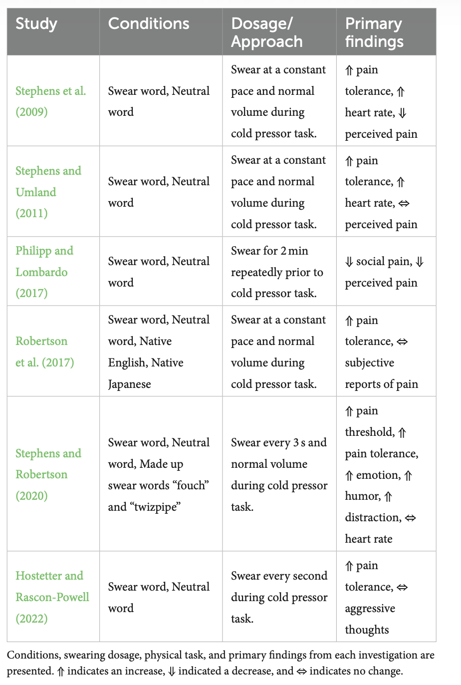
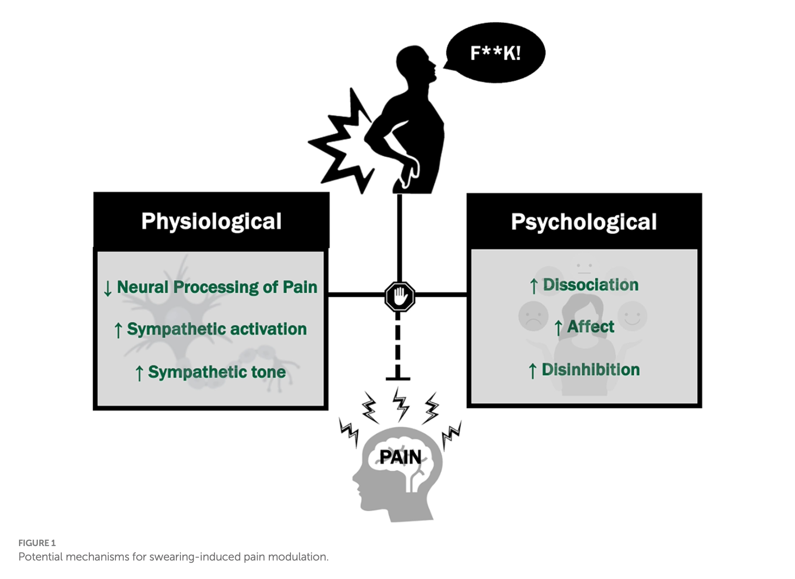
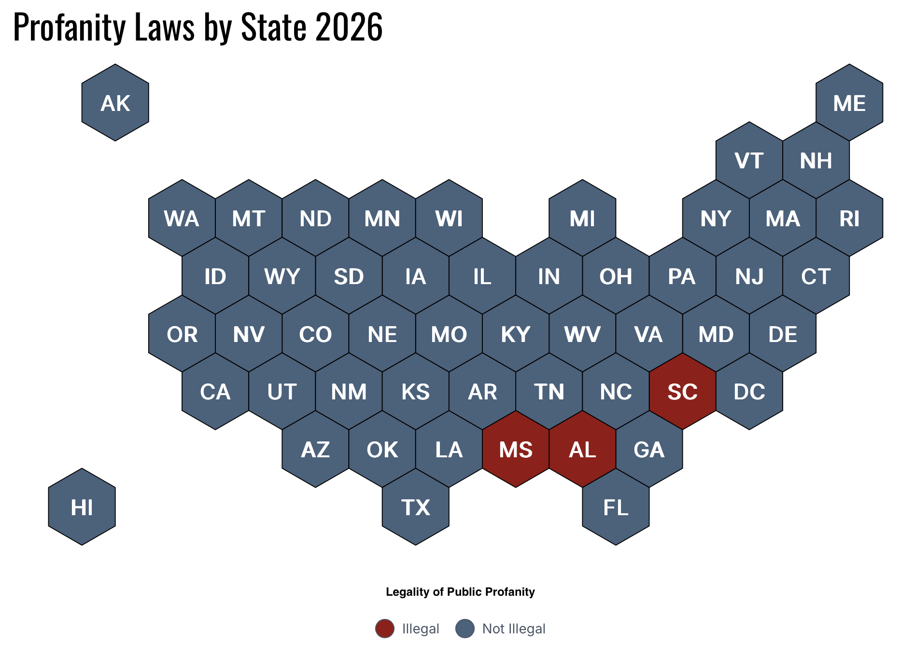

:::: {.r-fit-text .absolute top="300"}

What makes a word a swear word?

::::

##



## Dunny

- Probably related to the word _dun_ meaning brown (e.g. a _dun_ horse for a light brown, usually wild horse)
- In Australia and New Zealand, _dunny_ originally referred to an outhouse, broadened
- The polite term in Australia/NZ for referring to the room for defecating and urinating is 'the toilet'
- The Heeler family have a power negotiation when mum (Chilli) voices her dispreference for *dunny*

## *Lousy*

{.absolute left=0 right=0 bottom=0 top=0 height="90%" style="margin: auto auto;"}

## Ling Link

- Think about your own experiences with language, did your family have any words you just weren't supposed to say (like dunny or lousy)? How would you know?
- It can be pretty hard to know if something that was considered unsayable in your family is similarly bad for everyone.
- Where does the authority to use/not use "bad" words come from in your family?
- Discuss with the people near you for the next few minutes.

## Bringing some threads together today

:::: {.incremental}

- **Arbitrariness**: Language is deeply arbitrary and always changing
- **Prescriptivism**: attempts to dictate what counts as "good" or "acceptable" language usage; almost always lacks the power to actually do so!
- **Euphemism**: we avoid saying specific naughty/taboo words by replacing them with words that still point at the same _concept_.  Like we're avoiding magic words.
- **Slang**: has a _powerful_ in-group/out-group social function and helps the lexicon grow and change with time: innovative, fast moving

::::

## Offensiveness is culture-specific

{.absolute left=0 right=0 bottom=0 top=0 height="90%" style="margin: auto auto;"}

::: {.notes}

arse, bastard, prick, bollocks, git are pretty bad in the UK & Ireland. Second language learners are cautioned to avoid them in mixed company.  "damn, crap, bloody (very British), bugger, pissed off." are described as 'mild'.  'Pissed' meaning drunk doesn't even seem to be considered an expletive.
 
:::

## Offensiveness is sense-specific!

{.absolute left=0 right=0 bottom=0 top=0 height="90%" style="margin: auto auto;"}

## Offensiveness is all about connotations

{.absolute left=0 right=0 bottom=0 top=0 height="90%" style="margin: auto auto;"}

::: {.notes}

Swear words are swear words because of their emotional and social meanings, not really their denotations or literal meanings.

:::

## What kinds of meanings become swear words?

- blasphemy and religious oaths
- bodily waste elimination (words for defecation, urination, but rarely (ever?) menstruation)
- sex and sex organs
  - incest and illegitimate parentage
- perceived lack of intelligence or kindness
- femaleness (alas)

## If (potentially) offensive, why do it?

:::: {.incremental}

- Swearing, curse words\, obscenities, vulgarities, cuss words\, swear words\, taboo words\, potty words\, expletives\, profanity, foul mouth, we have *many* euphemisms for this behavior
- Swearing appears to be universal; all cultures have names for ideas, activities, deities, etc. that members of the culture are not meant to say
- So why do we do it? And, maybe just as interestingly, why do we sometimes not do it?

::::

## Swearing is...

:::: {.incremental}

- **Swearing** is the use of words that are deemed taboo to express the emotional state of the speaker
  - Swearing is *connotative*  meaning (both _emotional_ and _social_ connotations)
  - Swearing is about *license* and *politeness*
    - Swearing can serve a group cohesion function
  - Swearing is about *perception*  (what it means to hearers)

::::

## Swearing can be socially-useful

::::: {.incremental}

- Swearing isn't always rude
- It can be fun, funny, cathartic
- Swearing, like slang, can be used to indicate group membership or to show group cohesion
- Swearing can communicate to your interlocutor(s) that you see them as an equal--someone trustworthy
  - But seeing someone as an equal can also be rude (parents when you're little, interviewer, people you don't know)

:::::

## Swearing has pain-relieving properties!

:::::: {.columns}
::: {.column width="50%"}

- Swearing has well-documented hypoalgesic properties! [@HaySillsShoemakeBallmannStephensWashmuth2024]
- (at least if your hand is freezing in a lab)
- "Collectively, these well-powered studies consistently show that
swearing effectively modulates acute pain ... This suggests that the
hypoalgesic effects of swearing are a reliable finding"

:::

::: {.column width="50%"}

:::
::::::

## A real, published figure

:::::: {.columns}
::: {.column width="55%"}

:::

::: {.column width="45%"}

- We don't yet understand why/how swearing increases pain tolerance
- Clearly, swearing can be powerfully emotional for the talker
- But it can _also_ be powerfully emotional for the listener...

:::
::::::

## Swearing can be offensive

:::: {.incremental}

- Even when a specific word + sense _is_ considered a "bad" word by a culture, people still say it
- How do they know when/why that is less acceptable?
- Swearing can be offensive when it violates one or both of:
    - **Authority**: Some (parent, guardian, teacher, employer, religious text) dictates that certain words are forbidden.
    - **Politeness**: There are words we only really say if we are thoughtless or if our *intention* is to be hurtful, hateful, or mean.

::::

## Swearing is mostly legal in the US (2026)

## Legal limits on swearing

::: {.incremental}

- Courts have consistently found that swearing is protected by the First Amendment except:
- Threats against a person or property
- Harassment or repeated, targeted abuse
- Disorderly conduct or disturbing the peace
- "Fighting words" likely to provoke immediate violence
- Swearing, along with slurs and other potential hate speech, can be interpreted as evidence of hate speech

:::

## So what are the social limits on swearing?

::: {.incremental}

- One place we avoid swearing is when we don't know everyone in the room, why?
- In part because swearing, like slang, serves a social function
- Being comfortable swearing among people can mean that you are equals, that you trust each other, that you are comfortable violating norms together
- Swearing among people you don't know rudely assumes that you have their consent to violate norms

:::

## How does a word get to be rude in the first place?

* Like all words: history\, morphological processes\, and usage\!
* What word do you think this is?
  * Old English  _scitan_ \, from Proto\-Germanic  _\*skit\-_  \(source also of North Frisian  _skitj_ \, Dutch  _schijten_ \, German  _scheissen_ \)\, from Proto\-Indo\-European root  _\*_  _skei_  _\-_  “to cut\, split”\, extension of root  _\*_  _sek_  “to cut”
  * The idea is about separation from the body
  * And it’s related to  _science_ \,  _omniscient_ \, _ _ and  _conscience_ \!

## Comparative Reconstruction

* __Comparative reconstruction __ is a method used in historical linguistics to uncover vocabulary and structures of an ancestor language by drawing inferences from the evidence remaining in several daughter languages
  * Often dealing with the  _sounds_  of a language
- So\, with the previous example:
  * _\*_  _skei_  _\- > \*skit\- _ = vowel change\, addition of \[t\] \(though see  _\*_  _sek_  _\-_ \)
  * _\*skit\- > _  _scitan_  _ _ = maybe not a change for k > c \(?\)\, addition of verbal suffix
  * _scitan_  _ _ >  _shit_  = \[sk\] > \[ʃ\]\, loss of inflexion

## Doing stuff with language

* Language is the principal means we have to “do stuff”
  * To greet\, compliment\, and insult one another\,
  * To plead or flirt\,
  * To seek and supply information\, and
  * To accomplish hundreds of other daily tasks
* Actions that are carried out through language are called  __speech acts__
  * Such as lying\, promising\, greeting,
  * And euphemism, slang, and swearing!

## What’s next?

- Come on Wednesday for “Who says ‘pop’ and why?”
- Read Pullum chapter 4
- Quiz 5 Friday\!

## Reference for Historical Reconstruction Slide

[https://www\.etymonline\.com/search?q=shit](https://www.etymonline.com/search?q=shit)

## References

